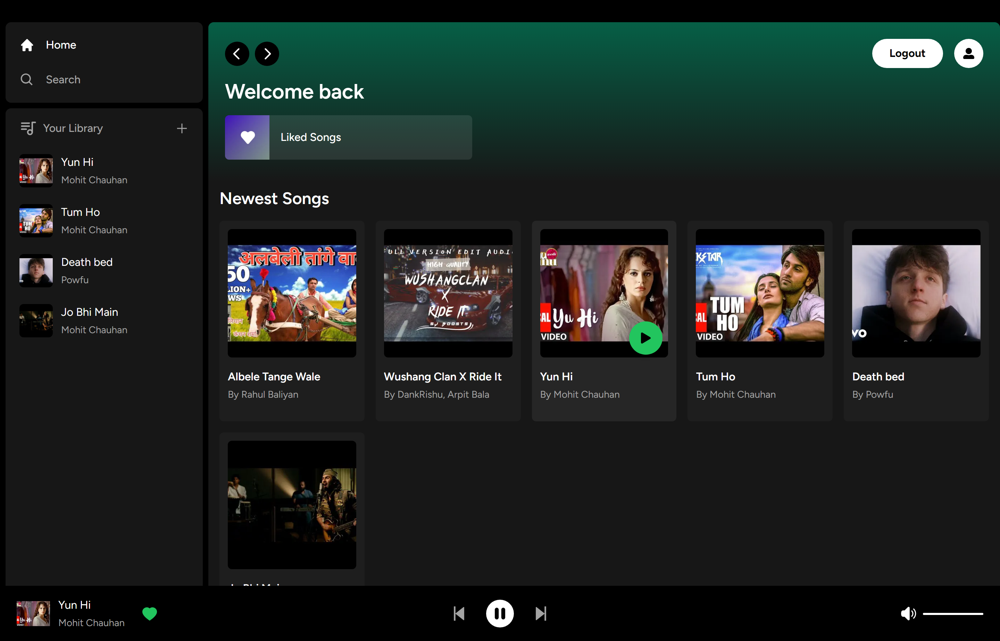
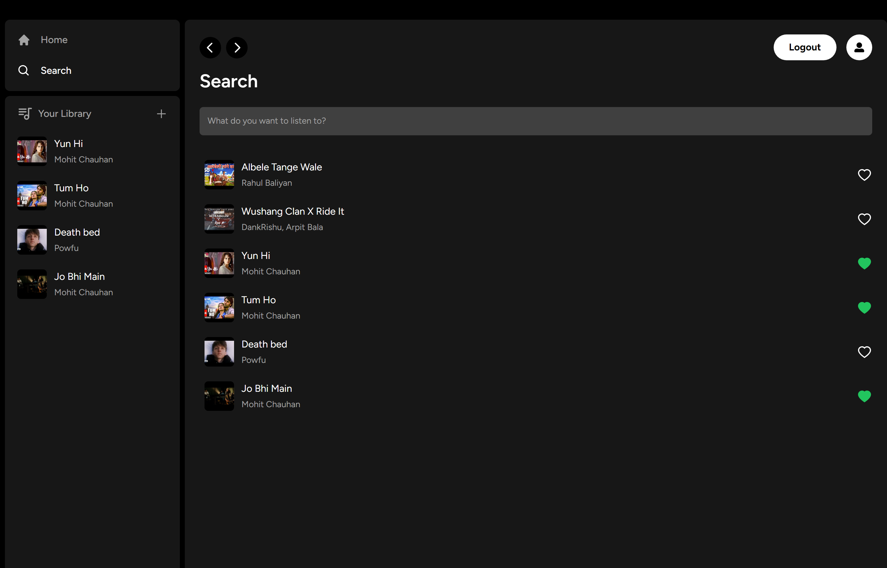
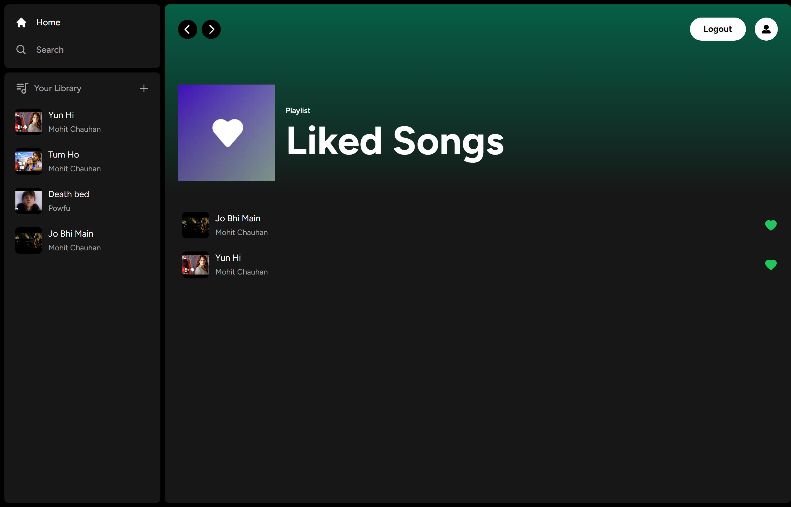
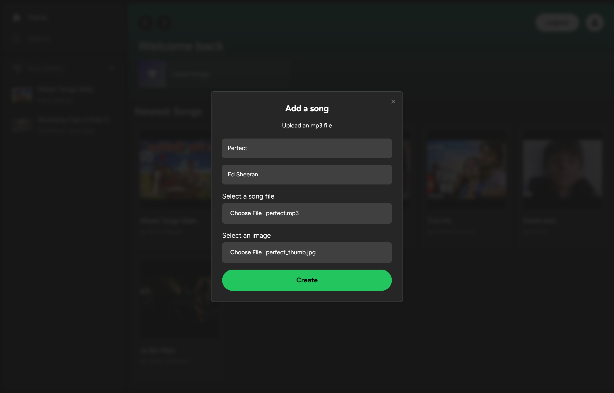
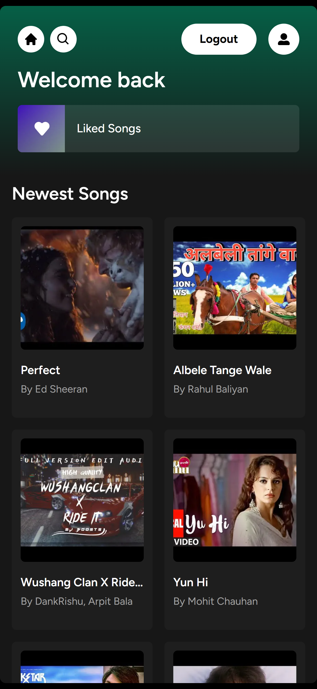
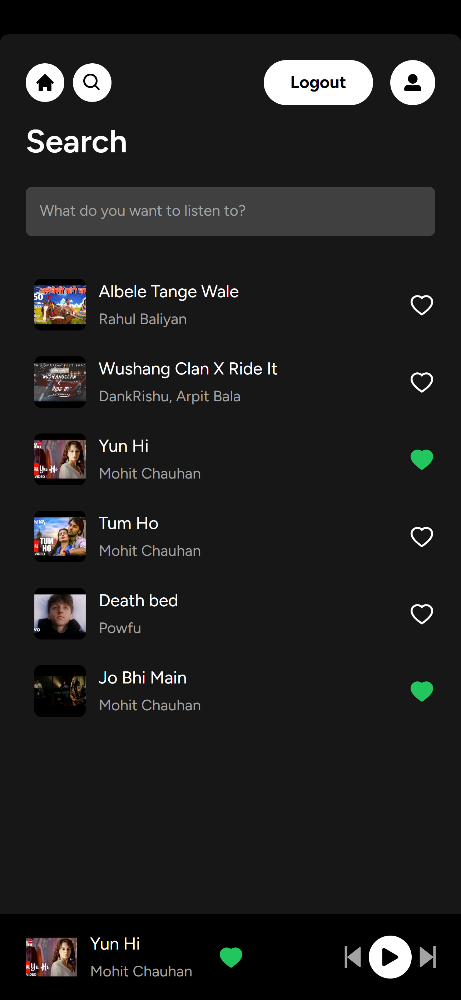
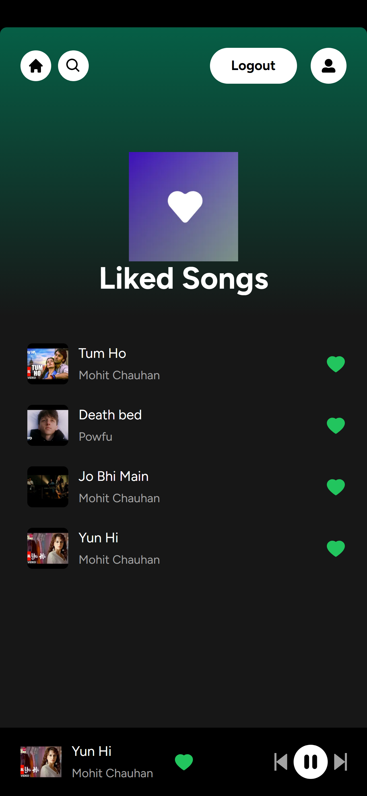

    
    <h1>Spotify</h1>
    
A captivating web platform inspired by Spotify, crafted for immersive music streaming experiences.

---

## Live Demo

Visit [web-sujal-spotify-clone.vercel.app](https://web-sujal-spotify-clone.vercel.app/) to see the project in action.

Guest login credentials :-

- email : ceyitiy893@acname.com
- password: password

<!-- for test subscription checkout, please use this card no.

- 4000003560000008 (for India)
- 4242 4242 4242 4242 (for Others) -->

## Screenshots

   
   
   
   
   
   
   

## Key Features

- **Subscription Support:** Enjoy access to premium features with subscription services.
- **Sleek User Interface:** Navigate through a modern interface inspired by Spotify's design.
- **Fully Responsive Layout:** Experience seamless compatibility across various devices.
- **Secure Authentication:** Protect your account with robust user authentication using Supabase.
- **Seamless Audio Playback:** Stream music effortlessly with uninterrupted playback.
- **Liked Songs:** Update, manage, and curate your liked songs anytime.
- **Advanced Music Player:** Enhance your listening experience with a feature-rich music player component.

## Tech Stack

This project is built using a variety of technologies:

- **Frontend**: Next.js, React, Tailwind CSS
- **Backend**: Supabase, PostgreSQL
- **Payment Processing**: Stripe
- **State management**: Zustand

## Installation

To install and run this project locally, follow these steps:

1. Clone the repository.
   `git clone https://github.com/SashenJayathilaka/Spotify-Clone.git`
2. Install dependencies: `npm install` or `yarn install`.
3. Install tailwind CSS with Next.js: `npm install -D tailwindcss postcss autoprefixer`

   `npx tailwindcss init -p`

4. Start the development server: `npm run dev` or `yarn dev`.

Open http://localhost:3000 with your browser to see the result.

## Credits

This project was inspired by the work of [Code with Antonio](https://github.com/AntonioErdeljac/) and the [Spotify App](https://open.spotify.com/).

## License

This project is licensed under the MIT License.
